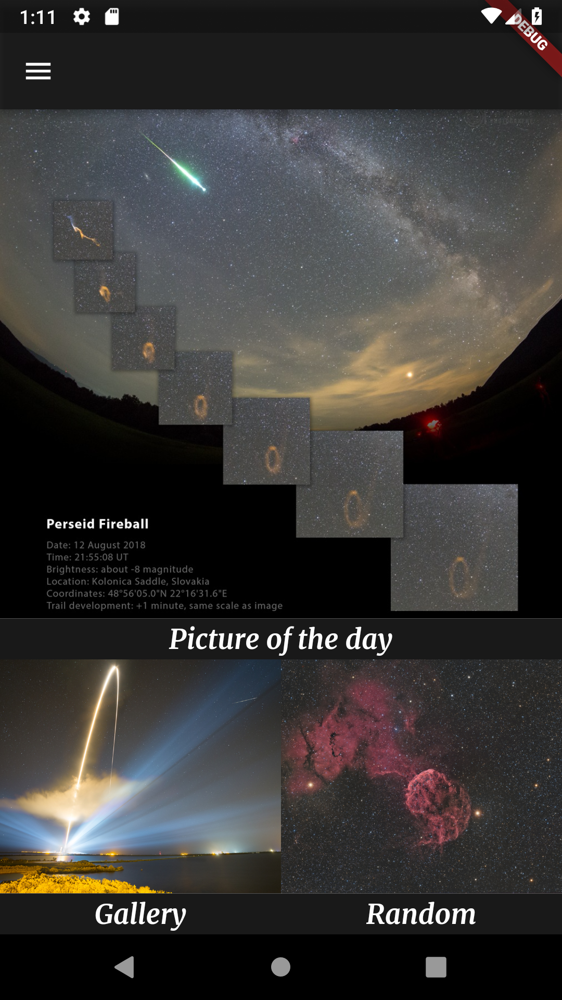
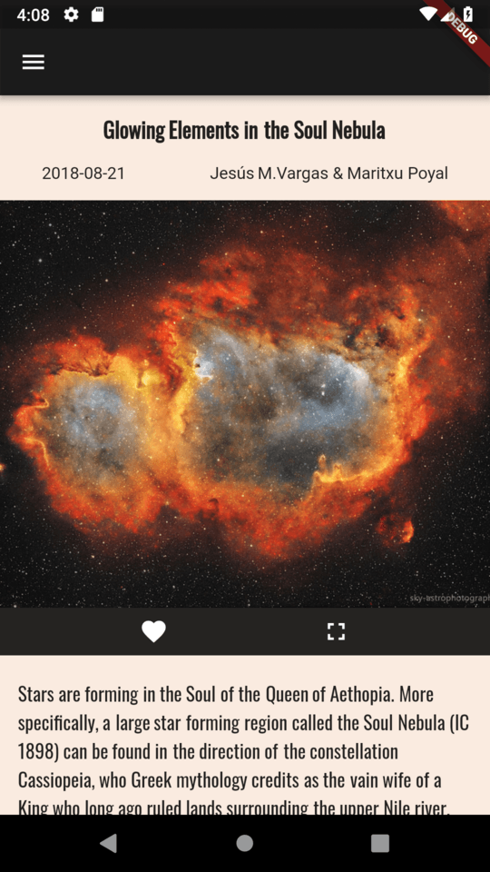
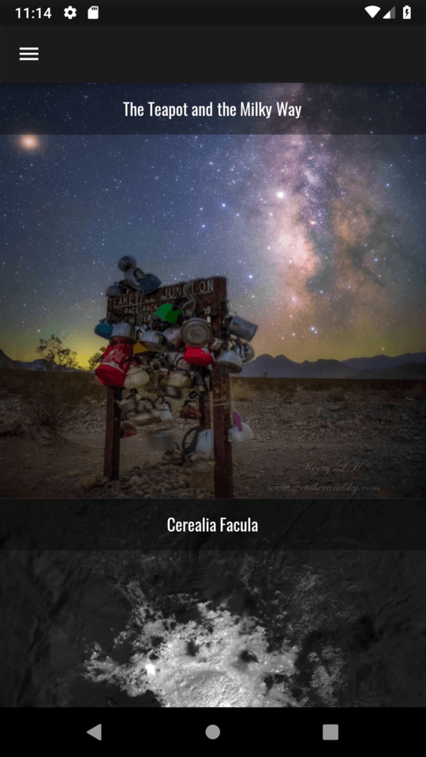
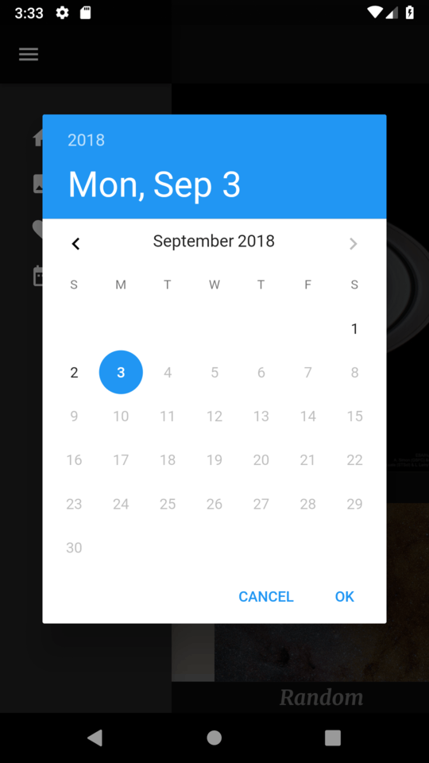

<h1 align="center">Spacey Boi ( browse pretty Space pictures )</h1>

  
<h3 align="center">Screenshots:</h3>

  
  
  
    

 

**ToDo**
- [ x ] Showcase pretty Nasa pictures on homepage
- [ x ] Async 60 days Scrollable Gallery View
- [ x ] Cache ^ above images so user doesn't refetch same data
- [ x ] Read more info about current picture
- [ x ] Store list of favorite images
- [ x ] Show favorite images
- [ ] Get picture from date
- [ ] Profit??